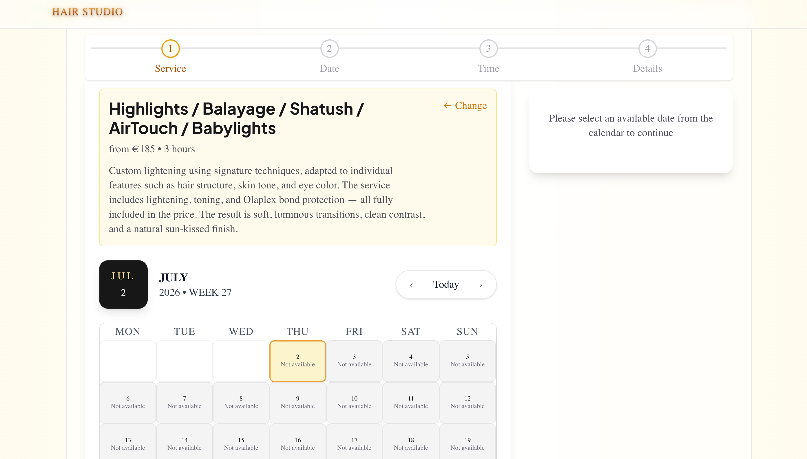
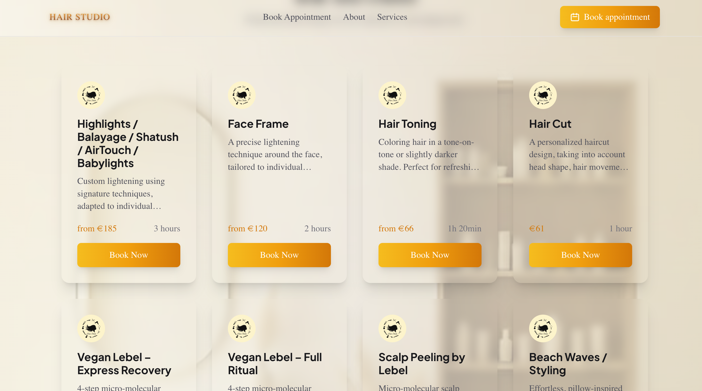
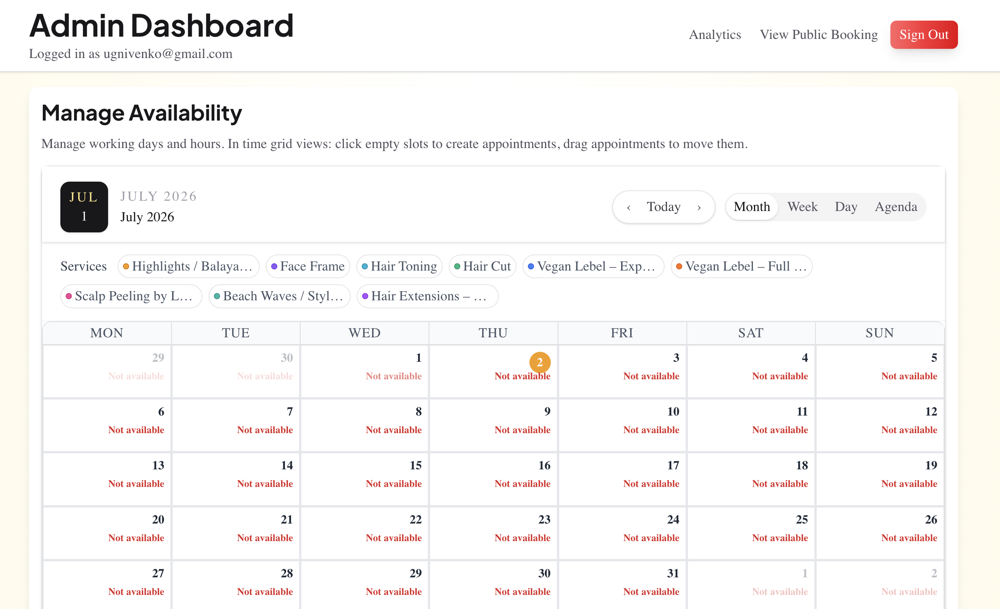
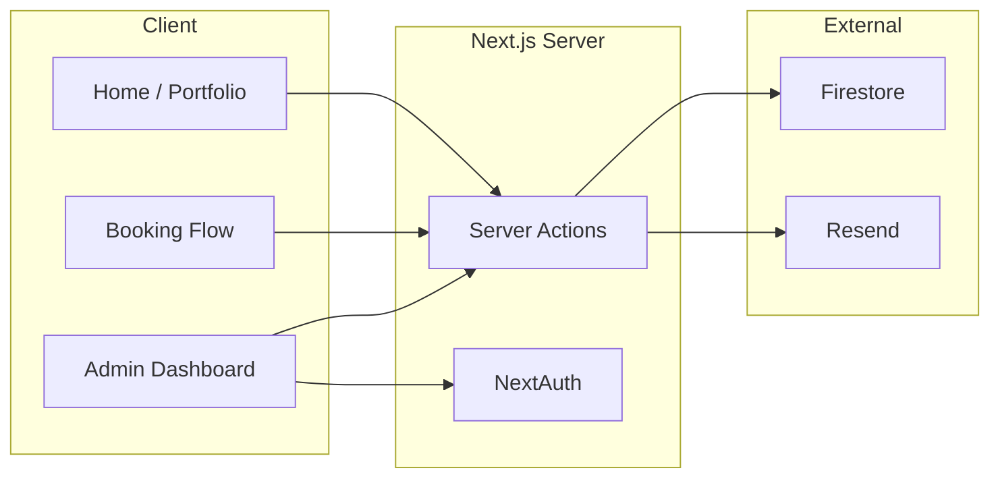

<div align="center">

# i-blond

**Portfolio and online booking site for Hair Chief — a hair studio in Amsterdam.**
*Built solo as a client project. Live in production.*

[](https://blond-house.vercel.app)
[](#license)
[](https://nextjs.org/)
[](https://www.typescriptlang.org/)
[](https://tailwindcss.com/)

<br/>

<a href="https://blond-house.vercel.app/">
  
</a>

<sub>Mobile-first portfolio · Public booking with real-time availability · Admin dashboard with FullCalendar</sub>

</div>

---

## Overview

Independent stylists lose bookings to friction: DMs, missed calls, back-and-forth about slots. i-blond gives Hair Chief one link — a polished portfolio *and* a self-serve booking flow that writes straight into an admin calendar with email confirmations for both sides.

Built solo as a paid client project for a working stylist in Amsterdam. I handled design, architecture, implementation, and deploy; the studio owner manages appointments day-to-day through the admin dashboard.

## Features

| | |
| :--- | :--- |
| **Portfolio** | Hero, about, approach, and services on a mobile-first layout tuned for the studio's brand. |
| **Public booking** | Service picker → calendar → time slot → confirmation, all without an account. |
| **Availability engine** | Working days and per-day availability windows are configured from the admin. |
| **Admin dashboard** | Protected FullCalendar view for creating, editing, and cancelling appointments. |
| **Transactional email** | Resend sends booking confirmations to the customer and notifications to the owner. |
| **SEO & analytics** | App Router metadata, sitemap, robots, JSON-LD, Vercel Analytics, Meta Pixel. |

## Screenshots

| | |
| :--- | :--- |
| [](public/images/Screenshot-home.png) | [](public/images/Screenshot-booking.png) |
| [](public/images/Screenshot-price.png) | [](public/images/Screenshot-admin.png) |

## Tech Stack

**Framework:** Next.js 16 (App Router) · React 19
**Language:** TypeScript 5
**Styling:** Tailwind CSS 4
**Data:** Firebase (Firestore)
**Auth:** NextAuth 5 (beta) · Firebase Adapter
**Email:** Resend
**Calendar:** FullCalendar (daygrid · timegrid · list · interaction)
**Validation:** Zod
**Testing:** Jest · Testing Library
**Deploy:** Vercel

## Architecture

The public site is a Next.js App Router app talking to Firestore through Server Actions — no hand-rolled REST layer. The admin surface sits behind a NextAuth session; the booking flow is anonymous and validated with Zod before it reaches the database. Resend fires transactional emails as a side effect of the booking action.



### Key decisions

<details>
<summary><strong>Why Server Actions instead of API routes?</strong></summary>
<br/>
The whole app is one Next.js deployment used by one studio — there is no second client, no mobile app, no third party consuming these endpoints. A REST layer would have meant hand-writing request/response types twice and shipping fetch wrappers to the client for no gain. Server Actions keep the booking mutation, its Zod validation, and its email side effects colocated with the form that triggers them, and they still run on the server.
</details>

<details>
<summary><strong>Why Firestore instead of Postgres?</strong></summary>
<br/>
The domain is small and mostly document-shaped: appointments, availability windows, and one admin user. There are no joins worth writing SQL for. Firestore also gave me hosted auth via the Firebase Adapter and a free tier that comfortably covers a single-studio workload, so I avoided standing up and paying for a managed Postgres just to store a few hundred rows per month.
</details>

## Project Structure

```text
app/
├── actions/        # Server actions (appointments, availability)
├── admin/          # Protected dashboard, login, analytics
├── api/auth/       # NextAuth route handler
├── book/           # Public booking flow (calendar + slots)
├── components/     # UI: home, booking, admin, shared
├── hooks/          # useBooking and friends
├── lib/            # Auth, Firebase, email, SEO, validation, types
├── privacy/        # Privacy policy
├── terms/          # Terms of service
├── embed/          # Embeddable booking widget
├── layout.tsx      # Root layout + metadata
├── page.tsx        # Home
├── sitemap.ts      # Dynamic sitemap
└── robots.ts       # robots.txt
public/images/      # Portfolio and brand assets
```

## Deployment

Deployed on Vercel with the `main` branch as production and preview deploys per PR. Environment variables (Firebase, NextAuth, Resend, admin credentials) are configured in the Vercel project — see [DEPLOY.md](./DEPLOY.md) and [env.example](./env.example).

## Security & Privacy

- Admin routes are gated by a NextAuth session; server actions call `requireAdmin` before any mutation on admin surfaces.
- Booking input is validated with Zod on the server before it reaches Firestore.
- Customer email is optional; when absent, only the owner notification is sent.
- Firestore rules live in [firestore-rules.txt](./firestore-rules.txt) and are applied out of band.
- **Known issue:** the admin uses credentials-based auth with env-configured `ADMIN_EMAIL` / `ADMIN_PASSWORD`. This is intentional for a single-operator studio but should not be reused for multi-user setups.

## Roadmap

**Done:** portfolio · public booking · admin dashboard · availability windows · confirmation and cancellation emails · SEO metadata and JSON-LD · Vercel Analytics.
**Next:** SMS reminders · richer analytics on the admin dashboard · calendar export (`.ics`) for confirmed bookings.
**Later:** multi-stylist support · loyalty / returning-customer tracking · CI with automated test runs on PRs (Jest exists locally but does not run in CI yet).

## FAQ

<details>
<summary><strong>Do customers need to create an account to book?</strong></summary>
<br/>
No. The booking flow is fully anonymous — pick a service, a day, a slot, and leave a name and contact. An email is only required if the customer wants a confirmation.
</details>

<details>
<summary><strong>How does the studio manage its own availability?</strong></summary>
<br/>
The admin dashboard exposes working days and per-day availability windows. Time slots shown to customers are derived from those windows minus already-booked appointments.
</details>

<details>
<summary><strong>Can the booking flow be embedded on another site?</strong></summary>
<br/>
There is an `/embed` route intended for that. It is functional but not yet documented for third parties.
</details>

## Acknowledgements

Built on the shoulders of [Next.js](https://nextjs.org/) · [React](https://react.dev/) · [Tailwind CSS](https://tailwindcss.com/) · [Firebase](https://firebase.google.com/) · [NextAuth.js](https://next-auth.js.org/) · [Resend](https://resend.com/) · [FullCalendar](https://fullcalendar.io/) · [Zod](https://zod.dev/). Thanks to Hair Chief for trusting a solo dev with the studio's front door.

## Author

**Yevhen Ugnivenko** — full-stack developer, Amsterdam. Designed, built, and deployed i-blond end-to-end as a client engagement for Hair Chief.

**GitHub:** [@EuvhenRight](https://github.com/EuvhenRight) · **Email:** [ugnivenko.ea@gmail.com](mailto:ugnivenko.ea@gmail.com)

## License

Proprietary — all rights reserved © Yevhen Ugnivenko · built for Hair Chief, Amsterdam.
